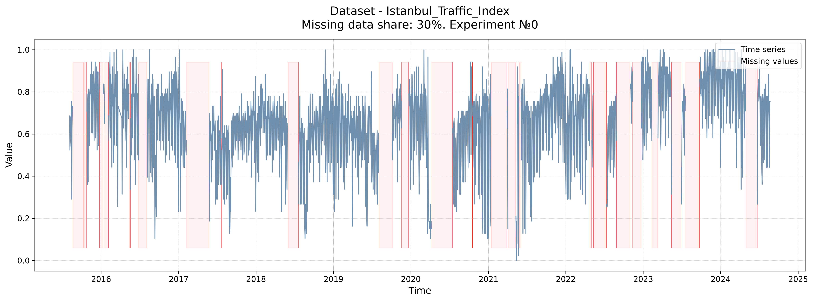
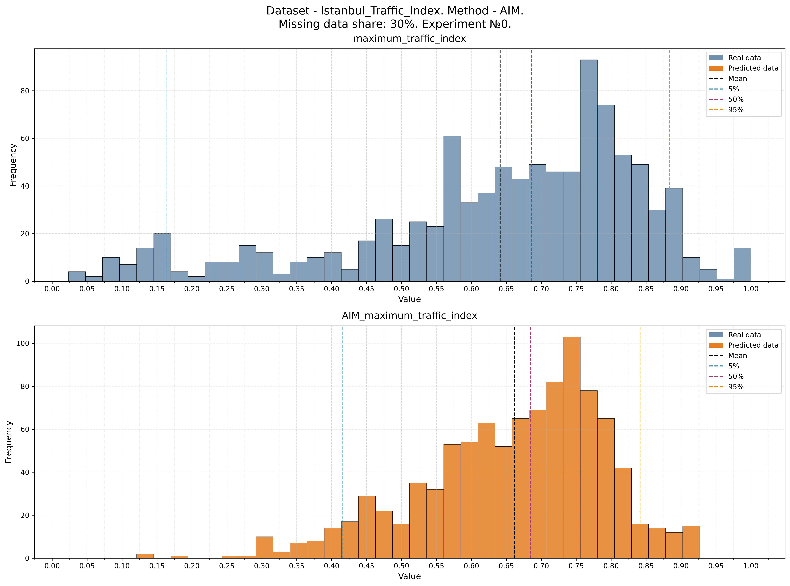
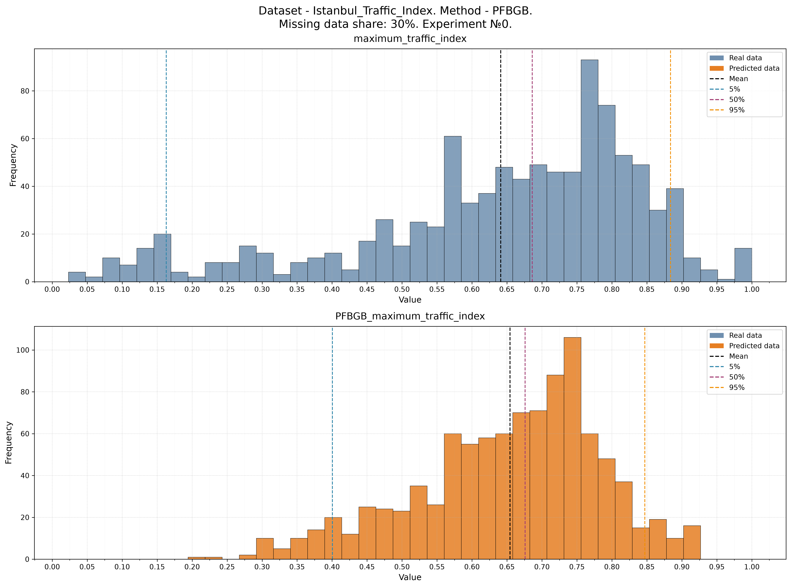
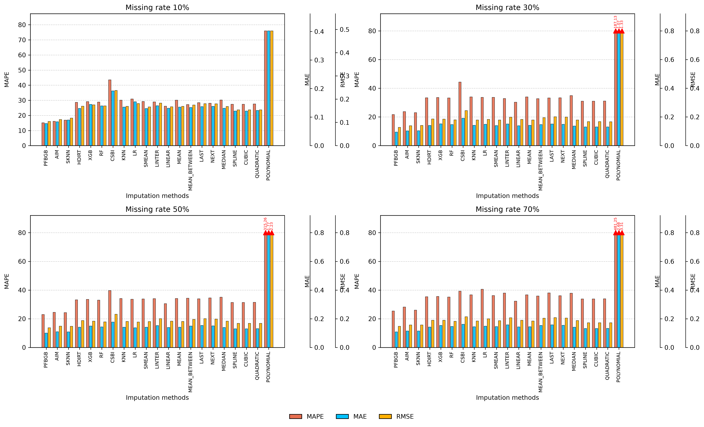
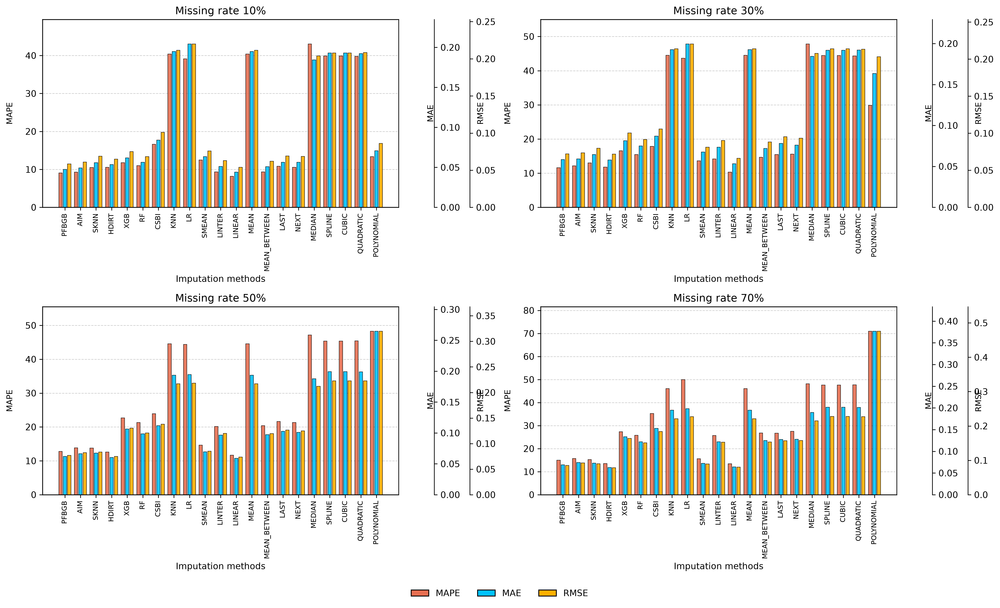

# PFBGB: Pre-Filled Bidirectional Gradient Boosting,


**PFBGB (Pre-Filled Bidirectional Gradient Boosting,)** is an approach for missing value imputation in time series based on gradient boosting with bidirectional training on pre-filled data.

This software was developed by **Nikita Vladimirovich Savvin** as part of a dissertation research project. The presented implementation corresponds to the materials of **Chapter 1** of the dissertation and is intended for conducting computational experiments on missing value imputation in time series.


## Quick Start

### 1. Installing dependencies

```bash
pdm install
```

### 2. Activating the virtual environment

```bash
source .venv/bin/activate
```

### 3. Running experiments

```bash
pdm run src/experiments/main.py
```

## Results

The experiment results are automatically saved to the directory:

```text
export/
```

## Project Structure

| Component | Location |
|-----------|----------|
| Application entry point | `src/experiments/main.py` |
| Computational experiment design | `src/experiments/experiment_design.py` |
| Dataset configuration | `src/data/data_config.py` |
| Missing value imputation methods implementation | `src/methods/imputation_methods.py` |

## Notes

- The main execution scenario is located in `src/experiments/main.py`.
- The identifier and parameters of the experiment to be launched are specified at the beginning of the `src/experiments/main.py` file.
- All results are automatically exported to the `export/` directory.


<h1 align="center">
PFBGB (Pre-Filled Bidirectional Gradient Boosting): an approach for missing value imputation in time series with bidirectional training on pre-filled input vector data
</h1>

<div align="center">

<p>
<b>Nikita Vladimirovich Savvin</b><br>
Email: <a href="mailto:savvin.nikita.work@yandex.ru">savvin.nikita.work@yandex.ru</a> &nbsp;&nbsp; ORCID: <a href="https://orcid.org/0009-0009-9163-6234">0009-0009-9163-6234</a>
</p>

</div>

<h2 align="center">Abstract</h2>

<p align="justify">
    The problem of missing value imputation in time series is considered as a data preparation stage for subsequent forecasting. One of the main challenges in applying machine learning methods for imputation is the need to form a complete lag context for each reconstructed value. In the presence of missing values, the continuity of the time series is disrupted, leading to an incomplete representation of input data and reduced reconstruction quality.
    The **PFBGB (Pre-Filled Bidirectional Gradient Boosting)** method is proposed, based on preliminary missing value filling using the SKNN method and subsequent reconstruction of the original values using the XGBoost gradient boosting model. A key feature of the method is the use of a bidirectional lag representation, including values both before and after the time point being reconstructed. Preliminary filling allows the formation of a complete temporal sequence context and the use of information from neighboring time intervals during training and missing value reconstruction.
    Experimental evaluation on energy, transportation traffic, and climate observation time series demonstrates that the proposed method provides higher reconstruction quality compared to baseline imputation approaches. The obtained results confirm the effectiveness of combining preliminary time series reconstruction, bidirectional lag context, and gradient boosting models for processing incomplete time series.
</p>

### Keywords

time series, missing value imputation, missing data filling, machine learning, gradient boosting, SFLXGB, lag features, seasonality, data preprocessing

<h2 align="center">Introduction</h2>

<p align="justify">
One of the key stages in improving the quality of time series modeling is data preparation. The problem of missing value imputation is of particular importance in this process, since gaps disrupt the temporal structure, reduce the available context, and decrease the quality of subsequent analysis and forecasting.
In real-world systems, time series almost always contain missing values caused by measurement device failures, telemetry loss, data transmission errors, and equipment maintenance. This problem is especially relevant for energy systems, transport monitoring, climate research, and industrial applications. For example, load forecasting is an important component of energy infrastructure management [1], while the development of digital systems requires the application of intelligent data analysis methods [2]. Modern forecasting models improve management efficiency [3], while mathematical methods for minimizing forecasting errors [4] and hybrid approaches combining statistical and neural network models [5] are also applied. Overall, reliable processing of incomplete data is a necessary condition for the digitalization of energy systems [6].
The problem of missing values significantly affects the quality of time series analysis. In [7], it is shown that the absence of measurements in hydrological data complicates the reconstruction of process dynamics, since local methods do not always account for changes in time series characteristics. Similar limitations are observed in landslide monitoring tasks [8] and energy systems, where missing measurements reduce load forecasting accuracy [9]. Moreover, long gaps lead to the loss of temporal context, while inaccurate reconstruction can alter the statistical properties of data and reduce the quality of subsequent modeling [10, 11]. The problem of adapting the requirements of modern forecasting methods to real incomplete data is also discussed in [12].
Missing value reconstruction methods are based on local patterns, statistical properties, and temporal dependency structures. In [7], it is demonstrated that linear interpolation is effective for short-term gaps but is limited when complex dynamics are present. For long gaps, approaches considering seasonality and relationships between parameters are used [10], while preserving the multidimensional structure of data is an important factor for improving reconstruction quality [8]. Additionally, [13] considers the assessment of observation reliability to improve data processing quality.
Despite the development of existing methods, challenges remain in reconstructing data with a high proportion of missing values, changing process characteristics, and complex dependencies between variables. In [14], it is shown that increasing method complexity does not always provide significant improvements in imputation quality, while the study [15] confirms the limitations of current approaches in compensating for information loss.
Promising directions include methods that account for temporal and spatial dependencies, as well as the uncertainty of reconstructed values. In [16], an approach combining missing value reconstruction and forecasting is proposed; [17] demonstrates the importance of considering correlations in multivariate time series; and [18] investigates universal time series representations for reconstruction and forecasting tasks. In energy applications, incomplete data reconstruction is used to improve the accuracy of generation and consumption estimation under limited measurement availability [19].
Thus, the task of missing value imputation in time series requires the development of methods that preserve temporal context and consider the characteristics of missing segments. This work proposes the PFBGB (Pre-Filled Bidirectional Gradient Boosting) method, based on bidirectional lag representation after preliminary missing value filling with consideration of temporal features, and the AIM (Ensemble Imputation Method), which uses adaptive selection of the reconstruction strategy depending on the characteristics of the missing segment.
</p>

<h2 align="center">Mathematical Model</h2>

<p align="justify">
In general form, the value of a time series is described by the following equation:

$$
y=(y_1,y_2,\dots,y_T) \tag{1}
$$

where $$y_t$$ is the observed value of the process at time $$t$$.
</p>

## Problem Statement

Existing methods for missing value imputation in time series include simple heuristics (mean value, last observation, linear extrapolation, etc.) and machine learning models. However, classical ML approaches, including gradient boosting, strongly depend on the selected lag length. With a minimal lag (lag = 1), the model uses an extremely limited context and loses information about the process dynamics.

When increasing the lag length, the problem of partially observed previous values for constructing a correct lag vector arises, which prevents the formation of a complete context for prediction.

$$
x_t^{partial}=(y_{t-1},\dots,NaN,\dots,y_{t-p}) \tag{2}
$$

where $$x_t^{partial}$$ is the partially observed state of the system; $$NaN$$ is the missing observation value; $$p$$ is the lag window length.

## Hypothesis 1. PFBGB (Pre-Filled Bidirectional Gradient Boosting)

It is assumed that preliminary filling of missing values followed by the formation of a bidirectional temporal context allows the hidden process dynamics to be reconstructed without losing information about the local structure of the time series. The method is based on training a gradient boosting model on fully observed segments of the series and subsequent prediction of missing values using the pre-filled lag space.

The preliminary reconstruction operator is formally introduced:

$$
Y^*=R_{pre}(Y)
\tag{3}
$$

where $$Y^*$$ is the pre-filled time series; $$R_{pre}(Y)$$ is the preliminary missing value filling operator using SKNN [20]; $$Y$$ is the original time series with missing values.

Only continuous intervals without missing values are used to construct the training dataset. For each time point, a bidirectional lag vector is formed:

$$
x_t=(z_{t-l_b},\dots,z_{t-1},z_{t+1},\dots,z_{t+l_a})
\tag{4}
$$

where $$x_t$$ is the feature vector for time point $$t$$; $$z_t$$ is the system state feature vector at time point $$t$$; $$l_b$$ is the number of previous observations; $$l_a$$ is the number of subsequent observations.

The sizes of the bidirectional temporal window are defined as follows:

$$
l_b=[L/2], \quad l_a=L-l_b
\tag{5}
$$

where $$L$$ is the total temporal window size; $$l_b$$ is the size of the left part of the window; $$l_a$$ is the size of the right part of the window.

The training dataset is formed as a set of "context — target value" pairs:

$$
D=\{(x_t,y_t)\}_{t=1}^{M}
\tag{6}
$$

where $$D$$ is the model training dataset; $$x_t$$ is the input bidirectional lag vector; $$y_t$$ is the observed time series value; $$M$$ is the number of training samples.

The main hypothesis of preserving dynamics during reconstruction is formulated as follows:

$$
F(x_t^{complete})\approx F(R_{pre}(x_t^{partial}))
\tag{7}
$$

where $$x_t^{complete}$$ is the fully observed lag vector of the system state; $$x_t^{partial}$$ is the lag vector with missing values; $$R_{pre}(x_t^{partial})$$ is the preliminary state reconstruction operator; $$F(\cdot)$$ is the gradient boosting model.

For each element of the time series, the rule for selecting the original or preliminary reconstructed value is applied:

$$
\tilde{y}_t=
\begin{cases}
y_t, & m_t=1\\
y_t^*, & m_t=0
\end{cases}
\tag{8}
$$

where $$y_t$$ is the original observed value; $$y_t^*$$ is the preliminary reconstructed value; $$m_t$$ is the indicator of the presence of the original observation.

After preliminary filling, the complete state vector is formed:

$$
z_t^*=(\tilde{y}_t,c_1(t),...,c_p(t))
\tag{9}
$$

where $$\tilde{y}_t$$ is the selected time series value; $$c_i(t)$$ are additional temporal features; $$p$$ is the number of additional features.

For each missing value, the reconstruction input vector is formed:

$$
x_t^{gap}=(z_{t-l_b}^{\ast},\dots,z_{t-1}^{\ast},z_{t+1}^{\ast},\dots,z_{t+l_a}^{\ast})
$$

where $$z_t^*$$ are features after preliminary filling; $$l_b$$ is the number of previous observations; $$l_a$$ is the number of future observations.

The reconstruction model is defined as an ensemble of decision trees:

$$
F(x_t)=\sum_{j=1}^{J}\eta f_j(x_t)
\tag{11}
$$

where $$f_j(x_t)$$ is the $$j$$-th decision tree; $$J$$ is the number of trees in the ensemble; $$\eta$$ is the learning rate.

The model is trained by minimizing the mean squared error:

$$
L=\frac{1}{M}\sum_{i=1}^{M}(y_i-F(x_i))^2
\tag{12}
$$

where $$M$$ is the number of training samples; $$y_i$$ is the true time series value; $$F(x_i)$$ is the model prediction.

The final reconstruction of missing values is performed using the following operator:

$$
\hat{y}_t=F(x_t^{gap}), \quad t\in G
\tag{13}
$$

where $$\hat{y}_t$$ is the reconstructed time series value; $$F(\cdot)$$ is the trained gradient boosting model; $$x_t^{gap}$$ is the bidirectional lag vector around the missing value; $$G$$ is the set of indices of missing values.

After reconstruction, the final time series is formed:

$$
\hat{Y}=\{\hat{y}_t:m_t=0;\ y_t:m_t=1\}
\tag{14}
$$

where $$y_t$$ are the original observed values; $$\hat{y}_t$$ are the reconstructed values; $$m_t$$ is the mask indicating the presence of the original value.

Thus, it is assumed that preliminary reconstruction of missing values enables the formation of a continuous feature space, providing the construction of a complete bidirectional temporal context. Subsequent training of the gradient boosting model on observed segments allows the reconstruction of local time series dependencies and improves the accuracy of missing value imputation.

## Hypothesis 2. AIM (Ensemble Imputation Method)

Missing value classification:

$$
c_t=\varphi(l_t), \quad l_t \in \mathbb{N} \tag{8}
$$

where $$c_t$$ is the missing value class; $$l_t$$ is the gap length; $$\varphi(\cdot)$$ is the classification function.

Set of methods:

$$
M=\{m_k\}_{k=1}^{N} \tag{9}
$$

Missing values:

$$
D_{miss}=\{y_t \mid t \in \Omega_{gap}\} \tag{10}
$$

Reconstruction:

$$
\hat{y}^{(k)} = m_k(D_{miss}) \tag{11}
$$

Error:

$$
L_k^{(c)} = L(\hat{y}^{(k)}, y) \tag{12}
$$

where $$L_k^{(c)}$$ is the error of method $$m_k$$ for class $$c$$; $$L(\cdot)$$ is the loss function; $$y$$ is the true time series.

Optimal method:

$$
m^*(c)=\arg\min_{m_k \in M} L_k^{(c)} \tag{13}
$$

Final reconstruction:

$$
\hat{y}_t=
\begin{cases}
m^*(c_t)(D_{miss}), & t \in \Omega_{gap} \\
y_t, & t \notin \Omega_{gap}
\end{cases}
\tag{14}
$$

<h2 align="center">Software Evaluation</h2>

Three datasets were used for software evaluation: **Russia Elista** (energy), **Istanbul Traffic** (transport traffic), and **Temperature** (climate data).

The comparative study considered the following missing value imputation methods:

| Method | Brief description |
|------|-------------------------------------------------------------------------------------------------------------------------------------------------------------------------------------------------------------------------------|
| PFBGB_imputation | A hybrid time series imputation method based on preliminary missing value filling using SKNN and subsequent reconstruction using the XGBoost model with bidirectional lag features. |
| PFBRF_imputation | A hybrid time series imputation method based on preliminary missing value filling using SKNN and subsequent reconstruction using the Random Forest model with bidirectional lag features. |
| XGB_imputation | Simple autoregression with a single lag (t-1) using XGBoost without complex windows and without feature missing value reconstruction. |
| RF_imputation | Same as XGB_imputation, but using RandomForest instead of XGBoost. |
| HDIRT_imputation | Reconstruction using a local linear model based on the nearest past and future values; linear interpolation is used when data is unavailable. |
| LR_imputation | Linear regression over the time axis: trend approximation of the series and missing value filling based on this trend. |
| SKNN_imputation | KNN imputation using lag features, where each missing value is represented by a historical window of values. |
| KNN_imputation | Classical KNN imputation using lag features without additional seasonal logic. |
| MEAN_BETWEEN_imputation | Filling using the average value between the nearest previous and subsequent observations. |
| MEAN_imputation | Filling using the global mean value of the series. |
| POLYNOMIAL_imputation | Third-degree polynomial interpolation for smooth reconstruction of nonlinear dependencies. |
| QUADRATIC_imputation | Second-order spline interpolation. |
| CUBIC_imputation | Third-order spline interpolation. |
| SPLINE_imputation | Cubic spline interpolation for smooth series reconstruction. |
| LINEAR_imputation | Linear interpolation between known points. |
| LAST_imputation | Forward fill: filling with the last known value. |
| MEDIAN_imputation | Filling with the median value of the entire series. |
| SMEAN_imputation | Seasonal filling using the average value for the corresponding month of observation. |
| LINTER_imputation | Local smoothing using a moving average followed by forward/backward fill for remaining missing values. |
| CSBI_imputation | Seasonal block reconstruction by transferring annual patterns; global mean is used when reconstruction fails. |
| AIM_imputation | Ensemble of methods: evaluates different imputations on artificially generated missing values and selects the best method for each missing value class. |

The experiments were conducted at four missing value levels: **10%**, **30%**, **50%**, and **70%**.

<p align="justify">
</p>


<p align="justify">
The procedure for conducting a single experiment consisted of the following stages.
</p>

<p align="justify">
<b>Step 1.</b> The number of removed values was determined as the product of the total number of time series observations and the specified missing value percentage.
</p>

<p align="justify">
<b>Step 2.</b> A set of random lengths of continuous missing intervals was generated, the sum of which was equal to the number of removed values. This approach ensured the presence of both short-term and long-term gaps.
</p>

<p align="justify">
<b>Step 3.</b> The generated intervals were randomly placed on the time axis without overlapping each other.
</p>

<p align="justify">
<b>Step 4.</b> The values belonging to the selected intervals were removed from the time series. An example of generating 30% missing values for the Istanbul_Traffic_Index dataset (experiment 0) is shown in Figure&nbsp;1.
</p>


<p align="center">
  
</p>

<p align="center">
  <b>Fig. 1.</b> An example of generating gaps in a time series<br>
  <b>Fig. 1.</b> An example of creating gaps in a time series
</p>

<p align="justify">
<b>Step 5.</b> The obtained incomplete series was reconstructed using all considered methods. An example of missing value reconstruction results for the Istanbul_Traffic_Index dataset at a 30% missing level (experiment 0) using the AIM and PFBGB methods is presented in Figures&nbsp;2 and 3, respectively.
</p>

<p align="center">
  
</p>

<p align="center">
  <b>Fig. 2.</b> An example of the distribution of real and imputed data using the AIM method.<br>
  <b>Fig. 2.</b> An example of the distribution of real and completed data using the AIM method.
</p>

<p align="center">
  
</p>

<p align="center">
  <b>Fig. 3.</b> An example of the distribution of real and imputed data using the PFBGB method.<br>
  <b>Fig. 3.</b> An example of the distribution of real and completed data using the PFBGB method.
</p>


<p align="justify">
<b>Step 6.</b> Quality metrics of the imputation were calculated for the reconstructed series, after which the results were saved for further analysis. The final metric values were calculated as the median values across all conducted experiments and are presented in Tables&nbsp;1–3 and Figures&nbsp;4–7.
</p>


The final metric values were calculated as the median values across all conducted experiments and are presented in Tables 1–3 and Figures 4–7.


<p align="right">
Table 1. Evaluation results of imputation methods for the "" dataset of the energy type.<br>
Table 1. The results of the evaluation of filling methods for dataset "" type of energy
</p>


<p align="center">
  
</p>

<p align="center">
  <b>Fig. 4.</b> Distribution of missing data imputation errors measured by MAE, MAPE, and RMSE metrics for the dataset.<br>
  <b>Fig. 4.</b> Distribution of missing data imputation errors measured by MAE, MAPE, and RMSE metrics for the dataset.
</p>


<p align="right">
Table 2. Evaluation results of imputation methods for the "Istanbul Traffic Index" traffic dataset.<br>
Table 2. Evaluation results of imputation methods for the "Istanbul Traffic Index" traffic dataset.
</p>


| Method       | 10% MAE | 10% MAPE | 10% RMSE | 30% MAE | 30% MAPE | 30% RMSE | 50% MAE | 50% MAPE | 50% RMSE | 70% MAE | 70% MAPE | 70% RMSE |
|--------------|---:|---:|---:|---:|---:|---:|---:|---:|---:|---:|---:|---:|
| ✅ PFBGB      | 0.078 | 15.118 | 0.104 | 0.095 | 21.642 | 0.128 | 0.100 | 22.934 | 0.137 | 0.108 | 25.417 | 0.148 |
| AIM          | 0.084 | 16.068 | 0.112 | 0.103 | 23.697 | 0.139 | 0.110 | 24.447 | 0.148 | 0.115 | 28.140 | 0.156 |
| SKNN         | 0.090 | 16.914 | 0.118 | 0.104 | 22.965 | 0.141 | 0.108 | 24.244 | 0.148 | 0.115 | 26.059 | 0.157 |
| HDIRT        | 0.131 | 28.658 | 0.170 | 0.141 | 33.307 | 0.186 | 0.141 | 33.243 | 0.187 | 0.142 | 35.371 | 0.189 |
| XGB          | 0.144 | 29.097 | 0.175 | 0.152 | 33.553 | 0.184 | 0.150 | 33.466 | 0.183 | 0.154 | 35.596 | 0.189 |
| RF           | 0.139 | 28.854 | 0.171 | 0.147 | 33.237 | 0.180 | 0.143 | 33.024 | 0.179 | 0.146 | 35.193 | 0.183 |
| CSBI         | 0.192 | 43.556 | 0.238 | 0.191 | 44.293 | 0.244 | 0.177 | 39.677 | 0.232 | 0.162 | 39.212 | 0.214 |
| KNN          | 0.135 | 30.086 | 0.169 | 0.142 | 34.012 | 0.179 | 0.142 | 34.077 | 0.181 | 0.144 | 36.647 | 0.185 |
| LR           | 0.154 | 30.894 | 0.181 | 0.149 | 33.652 | 0.182 | 0.137 | 33.614 | 0.177 | 0.149 | 40.543 | 0.200 |
| SMEAN        | 0.130 | 29.244 | 0.166 | 0.140 | 33.637 | 0.178 | 0.141 | 33.800 | 0.180 | 0.145 | 36.149 | 0.186 |
| LINTER       | 0.140 | 28.933 | 0.183 | 0.151 | 32.790 | 0.198 | 0.153 | 33.983 | 0.201 | 0.158 | 37.905 | 0.207 |
| LINEAR       | 0.131 | 26.154 | 0.167 | 0.138 | 30.293 | 0.183 | 0.139 | 30.575 | 0.183 | 0.143 | 32.224 | 0.189 |
| MEAN         | 0.135 | 30.086 | 0.169 | 0.142 | 34.012 | 0.179 | 0.142 | 34.077 | 0.181 | 0.144 | 36.647 | 0.185 |
| MEAN_BETWEEN | 0.134 | 27.222 | 0.175 | 0.147 | 32.751 | 0.195 | 0.149 | 34.304 | 0.196 | 0.153 | 35.875 | 0.203 |
| LAST         | 0.137 | 28.497 | 0.181 | 0.151 | 33.213 | 0.201 | 0.153 | 33.945 | 0.201 | 0.157 | 38.055 | 0.208 |
| NEXT         | 0.138 | 28.067 | 0.180 | 0.149 | 33.308 | 0.199 | 0.150 | 34.537 | 0.198 | 0.155 | 36.099 | 0.205 |
| MEDIAN       | 0.131 | 30.239 | 0.168 | 0.136 | 34.896 | 0.179 | 0.139 | 35.026 | 0.183 | 0.141 | 37.818 | 0.187 |
| SPLINE       | 0.121 | 27.349 | 0.154 | 0.130 | 31.003 | 0.167 | 0.130 | 31.349 | 0.168 | 0.132 | 33.820 | 0.172 |
| CUBIC        | 0.121 | 27.349 | 0.154 | 0.130 | 31.003 | 0.167 | 0.130 | 31.349 | 0.168 | 0.132 | 33.820 | 0.172 |
| QUADRATIC    | 0.123 | 27.567 | 0.154 | 0.131 | 31.043 | 0.167 | 0.132 | 31.418 | 0.168 | 0.133 | 33.872 | 0.172 |
| POLYNOMIAL   | 0.402 | 75.957 | 0.494 | 1.070 | 187.134 | 1.326 | 1.767 | 315.260 | 2.234 | 2.678 | 481.254 | 3.310 |


<p align="center">
  
</p>

<p align="center">
  <b>Fig. 5.</b> Distribution of missing data imputation errors measured by MAE, MAPE, and RMSE metrics for the "Istanbul Traffic Index" dataset.
</p>


<p align="right">
Table 3. Evaluation results of imputation methods for the "Daily Climate" climate dataset.
</p>


| Method         | 10% MAE | 10% MAPE | 10% RMSE | 30% MAE | 30% MAPE | 30% RMSE | 50% MAE | 50% MAPE | 50% RMSE | 70% MAE | 70% MAPE | 70% RMSE |
|---------------|---:|---:|---:|---:|---:|---:|---:|---:|---:|---:|---:|---:|
| ✅  **PFBGB** | **0.048** | **9.062** | **0.058** | **0.058** | **11.587** | **0.072** | **0.062** | **12.806** | **0.077** | **0.069** | **14.970** | **0.085** |
| AIM           | 0.049 | 9.300 | 0.061 | 0.059 | 12.144 | 0.074 | 0.066 | 13.818 | 0.082 | 0.074 | 15.665 | 0.093 |
| SKNN          | 0.056 | 10.515 | 0.069 | 0.064 | 13.023 | 0.080 | 0.067 | 13.762 | 0.083 | 0.073 | 15.244 | 0.090 |
| HDIRT         | 0.054 | 10.540 | 0.065 | 0.058 | 11.791 | 0.072 | 0.060 | 12.622 | 0.075 | 0.063 | 13.487 | 0.078 |
| XGB           | 0.062 | 11.750 | 0.075 | 0.081 | 16.567 | 0.100 | 0.106 | 22.686 | 0.130 | 0.134 | 27.309 | 0.164 |
| RF            | 0.056 | 10.992 | 0.068 | 0.075 | 15.440 | 0.092 | 0.099 | 21.339 | 0.121 | 0.122 | 25.840 | 0.151 |
| CSBI          | 0.084 | 16.637 | 0.101 | 0.087 | 17.871 | 0.106 | 0.112 | 23.928 | 0.138 | 0.153 | 35.263 | 0.184 |
| KNN           | 0.195 | 40.412 | 0.211 | 0.192 | 44.515 | 0.214 | 0.193 | 44.573 | 0.217 | 0.195 | 46.060 | 0.221 |
| LR            | 0.204 | 39.116 | 0.220 | 0.199 | 43.675 | 0.220 | 0.195 | 44.399 | 0.218 | 0.198 | 49.973 | 0.227 |
| SMEAN         | 0.064 | 12.500 | 0.076 | 0.068 | 13.621 | 0.081 | 0.069 | 14.614 | 0.085 | 0.072 | 15.608 | 0.089 |
| LINTER        | 0.051 | 9.365 | 0.063 | 0.073 | 14.178 | 0.090 | 0.097 | 20.165 | 0.120 | 0.122 | 25.668 | 0.153 |
| LINEAR        | 0.044 | 8.203 | 0.054 | 0.053 | 10.293 | 0.066 | 0.059 | 11.668 | 0.074 | 0.064 | 13.460 | 0.080 |
| MEAN          | 0.195 | 40.412 | 0.211 | 0.192 | 44.515 | 0.214 | 0.193 | 44.573 | 0.217 | 0.195 | 46.060 | 0.221 |
| MEAN_BETWEEN  | 0.051 | 9.321 | 0.062 | 0.072 | 14.673 | 0.088 | 0.097 | 20.381 | 0.120 | 0.125 | 26.775 | 0.153 |
| LAST          | 0.056 | 10.809 | 0.069 | 0.078 | 15.458 | 0.095 | 0.103 | 21.650 | 0.126 | 0.127 | 26.719 | 0.157 |
| NEXT          | 0.056 | 10.564 | 0.069 | 0.076 | 15.559 | 0.093 | 0.101 | 21.300 | 0.125 | 0.128 | 27.486 | 0.158 |
| MEDIAN        | 0.184 | 43.051 | 0.204 | 0.184 | 47.823 | 0.208 | 0.188 | 47.161 | 0.212 | 0.189 | 48.137 | 0.215 |
| SPLINE        | 0.193 | 39.884 | 0.208 | 0.192 | 44.429 | 0.214 | 0.199 | 45.364 | 0.223 | 0.201 | 47.633 | 0.228 |
| CUBIC         | 0.193 | 39.884 | 0.208 | 0.192 | 44.429 | 0.214 | 0.199 | 45.364 | 0.223 | 0.201 | 47.633 | 0.228 |
| QUADRATIC     | 0.192 | 39.767 | 0.208 | 0.192 | 44.301 | 0.213 | 0.199 | 45.411 | 0.223 | 0.201 | 47.668 | 0.227 |
| POLYNOMIAL    | 0.071 | 13.349 | 0.086 | 0.163 | 29.848 | 0.203 | 0.265 | 48.246 | 0.320 | 0.377 | 70.929 | 0.475 |


<p align="center">
  
</p>

<p align="center">
  <b>Fig. 6.</b> Distribution of missing data imputation errors measured by MAE, MAPE, and RMSE metrics for the "Daily Climate" dataset.
</p>

<h2 align="center">Conclusion</h2>

<p align="justify">
Within the framework of this study, the scientific problem of developing a method for missing value imputation in time series was solved, ensuring the preservation of the temporal structure of data and improving imputation accuracy under conditions of incompleteness, non-stationarity, and various missing value patterns.
The scientific novelty of the work lies in the development of the PFBGB (Pre-Filled Bidirectional Gradient Boosting) method, based on the combined use of preliminary missing value filling, bidirectional lag representation, and training a gradient boosting model on fully observed segments of the time series. Unlike traditional approaches that use limited historical context or require the removal of incomplete observations, the proposed method enables the formation of a continuous feature space considering dependencies both before and after the reconstructed value. This provides a more complete representation of local process dynamics and reduces the impact of time series gaps on reconstruction quality.
Additionally, the AIM (Ensemble Imputation Method) approach was developed, based on adaptive selection of the reconstruction method depending on missing value characteristics. The use of a combination of methods with different properties allows the approach to account for the specifics of short and long gaps and improves reconstruction robustness for time series with different patterns.
Experimental evaluation was performed on real-world datasets from three application domains: energy, transport traffic, and climate observations. To assess the robustness and reproducibility of the results, 100 independent experiments were conducted with different locations, lengths, and structures of missing segments at missing data levels ranging from 10% to 70%. The results demonstrated that the PFBGB and AIM methods provide the highest reconstruction quality among the considered algorithms for all investigated types of time series.
The proposed methods reduced reconstruction error by an average of 10% according to the MAPE metric compared to the baseline gradient boosting approach and outperformed the best alternative methods using historical and seasonal dependencies by approximately 1%. The obtained results confirm the effectiveness of using bidirectional temporal context and adaptive algorithm selection strategies to improve missing value imputation accuracy.
The practical significance of the work lies in the possibility of applying the proposed methods in monitoring and analysis systems for time-dependent data in energy infrastructure, transport systems, climate observations, and other applied domains. The developed approaches can be used as an independent data preprocessing stage to improve the reliability of subsequent forecasting and decision-making based on time series.
</p>

<h2 align="center">References</h2>
<ol align="justify">
  <li>Palchevsky E. V., Antonov V. V., Kromina L. E., Rodionova L. E., Fakhrunina A. R. Intelligent forecasting of electricity consumption in managing energy enterprises in order to carry out energy-saving measures // Mechatronics, Automation, Control. 2023. Vol. 24. No. 6. P. 307–316. DOI: 10.17587/mau.24.307-316.</li>

  <li>Gulay A. V., Zaitsev V. M. Digital control of trends in changes of sensor parameters in intelligent systems // Mechatronics, Automation, Control. 2018. Vol. 19. No. 7. P. 442–450. DOI: 10.17587/mau.19.442-450.</li>

  <li>Vasiliev D. A., Kolokolov M. V., Ivashchenko V. A. Electricity consumption forecasting in automated energy management systems of industrial enterprises // Mechatronics, Automation, Control. 2010. No. 8. P. 58–60.</li>

  <li>Ignatov N. A. Implementation of the energy efficiency concept in automated control systems based on forecasting electricity market parameters // Mechatronics, Automation, Control. 2011. No. 6. P. 48–55.</li>

  <li>Vasiliev D. A. Hybrid model for forecasting electrical loads of industrial enterprises // Mechatronics, Automation, Control. 2011. No. 9. P. 37–40.</li>

  <li>Antonov V. V., Kromina L. A., Rodionova L. E., Fakhrullina A. R., Baimurzina L. I., Palchevsky E. V., Rodionov E. A. Concept of forming intelligent control systems for urban power supply networks // Mechatronics, Automation, Control. 2023. Vol. 24. No. 4. P. 190–198. DOI: 10.17587/mau.24.190-198.</li>

  <li>Niedzielski T., Halicki M. Improving Linear Interpolation of Missing Hydrological Data by Applying Integrated Autoregressive Models // Water Resources Management. 2023. Vol. 37. No. 14. P. 5707–5724. DOI: https://doi.org/10.1007/s11269-023-03625-7.</li>

  <li>Wang C., Zhao Y. Time Series Prediction Model of Landslide Displacement Using Mean-Based Low-Rank Autoregressive Tensor Completion // Applied Sciences. 2023. Vol. 13. No. 8. P. 5214. DOI: https://doi.org/10.3390/app13085214.</li>

  <li>Hussain A., Giangrande P., Franchini G., Fenili L., Messi S. Analyzing the Effect of Error Estimation on Random Missing Data Patterns in Mid-Term Electrical Forecasting // Electronics. 2025. Vol. 14. No. 7. P. 1383. DOI: https://doi.org/10.3390/electronics14071383.</li>

  <li>Wijesekara L., Liyanage L. Mind the Large Gap: Novel Algorithm Using Seasonal Decomposition and Elastic Net Regression to Impute Large Intervals of Missing Data in Air Quality Data // Atmosphere. 2023. Vol. 14. No. 2. P. 355. DOI: https://doi.org/10.3390/atmos14020355.</li>

  <li>Pumi G., Prass T. S., Verdum D. K. A Novel Multiple Imputation Approach For Parameter Estimation in Observation-Driven Time Series Models With Missing Data // arXiv (Cornell University). DOI: https://doi.org/10.48550/arxiv.2601.01259.</li>

  <li>Zhu Y., Jiang B., Jin H., Zhang M., Gao F., Huang J., Lin T., Wang X. Networked Time-series Prediction with Incomplete Data via Generative Adversarial Network // ACM Transactions on Knowledge Discovery from Data. 2024. Vol. 18. No. 5. P. 1–25. DOI: https://doi.org/10.1145/3643822.</li>

  <li>Namasudra S., Dhamodharavadhani S., Rathipriya R., González Crespo R., Moparthi N. R. Enhanced Neural Network-Based Univariate Time-Series Forecasting Model for Big Data // Big Data. 2024. Vol. 12. No. 2. P. 83–99. DOI: https://doi.org/10.1089/big.2022.0155.</li>

  <li>Arnaut F., Đurđević V., Kolarski A., Srécković V. A., Jevremović S. Improving Air Quality Data Reliability through Bi-Directional Univariate Imputation with the Random Forest Algorithm // Sustainability. 2024. Vol. 16. No. 17. P. 7629. DOI: https://doi.org/10.3390/su16177629.</li>

  <li>Zhang C., Ding W., Zhang L. Impacts of Missing Buoy Data on LSTM-Based Coastal Chlorophyll-a Forecasting // Water. 2024. Vol. 16. No. 21. P. 3046. DOI: https://doi.org/10.3390/w16213046.</li>

  <li>Li J., Wang C., Su W., Ye D., Wang Z. Uncertainty-Aware Self-Attention Model for Time Series Prediction with Missing Values // Fractal and Fractional. 2025. Vol. 9. No. 3. P. 181. DOI: https://doi.org/10.3390/fractalfract9030181.</li>

  <li>Zhong K., Sun X., Liu G., Jiang Y., Ouyang Y., Wang Y. Attention-based generative adversarial networks for aquaponics environment time series data imputation // Information Processing in Agriculture. 2024. Vol. 11. No. 4. P. 542–551. DOI: https://doi.org/10.1016/j.inpa.2023.10.001.</li>

  <li>Talukder S., Yue Y., Gkioxari G. TOTEM: TOkenized Time Series EMbeddings for General Time Series Analysis // arXiv (Cornell University). DOI: https://doi.org/10.48550/arxiv.2402.16412.</li>

  <li>Phan Q.-T., Wu Y.-K., Phan Q. D. An innovative hybrid model combining informer and K-Means clustering methods for invisible multisite solar power estimation // IET Renewable Power Generation. 2024. Vol. 18. No. S1. P. 4318–4333. DOI: https://doi.org/10.1049/rpg2.13176.</li>

  <li>Vasenin D., Pasetti M., Astolfi D., Savvin N., Rinaldi S., Berizzi A. Incorporating Seasonal Features in Data Imputation Methods for Power Demand Time Series // IEEE Access. 2024. Vol. 12. P. 103520–103536. DOI: https://doi.org/10.1109/ACCESS.2024.3434652.</li>
</ol>