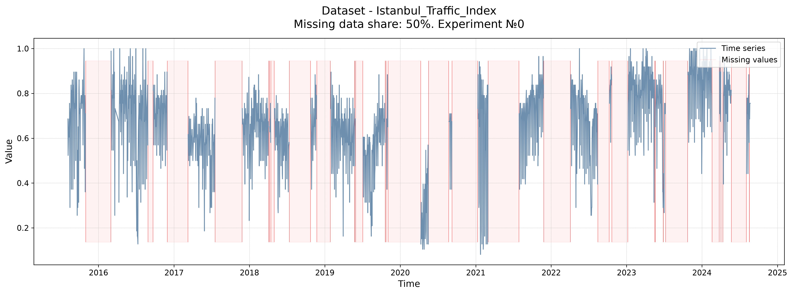

# PFBGB: Pre-Filled Bidirectional Gradient Boosting,


**PFBGB (Pre-Filled Bidirectional Gradient Boosting,)** — подход к восстановлению пропусков во временных рядах на основе градиентного бустинга с бинаправленным обучением на предзаполненных данных .

Данное программное обеспечение разработано **Саввиным Никитой Владимировичем** в рамках диссертационного исследования. Представленная реализация соответствует материалам **главы 1** диссертационной работы и предназначена для проведения вычислительных экспериментов по восстановлению пропусков во временных рядах.


## Быстрый запуск

### 1. Установка зависимостей

```bash
pdm install
```

### 2. Активация виртуального окружения

```bash
source .venv/bin/activate
```

### 3. Запуск экспериментов

```bash
pdm run src/experiments/main.py
```

## Результаты

Результаты выполнения экспериментов автоматически сохраняются в директорию:

```text
export/
```

## Структура проекта

| Компонент | Расположение |
|-----------|--------------|
| Точка входа приложения | `src/experiments/main.py` |
| Дизайн вычислительных экспериментов | `src/experiments/experiment_design.py` |
| Конфигурация наборов данных | `src/data/data_config.py` |
| Реализация методов восстановления пропусков | `src/methods/imputation_methods.py` |

## Примечания

- Основной сценарий запуска расположен в `src/experiments/main.py`.
- В начале файла `src/experiments/main.py` задаются идентификатор и параметры запускаемого эксперимента.
- Все результаты автоматически экспортируются в директорию `export/`.


# PFBGB (Pre-Filled Bidirectional Gradient Boosting): подход к восстановлению пропусков во временных рядах на основе градиентного бустинга с бинаправленным обучением на предзаполненных данных


<h2 align="center">Аннотация</h2>

<p align="justify">
    Рассматривается задача восстановления пропусков во временных рядах как этап подготовки данных для последующего прогнозирования. Одной из основных проблем применения методов машинного обучения для импутации является необходимость формирования полного лагового контекста для каждого восстанавливаемого значения. При наличии пропусков нарушается непрерывность временного ряда, что приводит к неполному представлению входных данных и снижению качества восстановления.
    Предлагается метод **PFBGB (Pre-Fill Bidirectional Gradient Boosting)**, основанный на предварительном заполнении пропусков с использованием метода SKNN и последующем восстановлении исходных значений с помощью модели градиентного бустинга XGBoost. Ключевой особенностью метода является использование двунаправленного лагового представления, включающего значения как до, так и после восстанавливаемого момента времени. Предварительное заполнение позволяет сформировать полный контекст временной последовательности и использовать информацию из соседних временных интервалов при обучении и восстановлении пропущенных значений.
    Экспериментальная оценка на временных рядах энергетики, транспортного трафика и климатических наблюдений показывает, что предложенный метод обеспечивает более высокое качество восстановления по сравнению с базовыми подходами импутации. Полученные результаты подтверждают эффективность совместного использования предварительной реконструкции временного ряда, двунаправленного лагового контекста и моделей градиентного бустинга для работы с неполными временными рядами.
</p>

### Ключевые слова

временные ряды, восстановление пропусков, заполнение пропусков, машинное обучение, градиентный бустинг, SFLXGB, лаговые признаки, сезонность, предобработка данных


<h2 align="center">Введение</h2>

<p align="justify">
Одним из ключевых этапов повышения качества моделирования временных рядов является подготовка данных. Особую значимость в данном процессе имеет проблема восстановления пропущенных значений, поскольку разрывы нарушают временную структуру, уменьшают доступный контекст и снижают качество последующего анализа и прогнозирования.
В реальных системах временные ряды практически всегда содержат пропуски, возникающие вследствие отказов измерительных устройств, потери телеметрии, ошибок передачи данных и технического обслуживания оборудования. Данная проблема особенно актуальна для энергетики, транспортного мониторинга, климатических исследований и промышленных систем. Так, прогнозирование нагрузки является важным элементом управления энергетической инфраструктурой [1], а развитие цифровых систем требует применения интеллектуальных методов анализа данных [2]. Современные модели прогнозирования позволяют повысить эффективность управления [3], при этом используются математические методы минимизации ошибки прогноза [4] и гибридные подходы, объединяющие статистические и нейросетевые модели [5]. В целом надежная обработка неполных данных является необходимым условием цифровизации энергетических систем [6].
Проблема пропусков существенно влияет на качество анализа временных рядов. В работе [7] показано, что отсутствие измерений в гидрологических данных затрудняет восстановление динамики процессов, поскольку локальные методы не всегда учитывают изменение характеристик ряда. Аналогичные ограничения наблюдаются в задачах мониторинга оползней [8] и энергетических системах, где пропуски измерений снижают точность прогнозирования нагрузки [9]. Кроме того, длительные разрывы приводят к потере временного контекста, а некорректное восстановление может изменять статистические свойства данных и снижать качество последующего моделирования [10, 11]. Проблема согласования требований современных методов прогнозирования с реальными неполными данными рассматривается также в [12].
Для восстановления пропусков применяются методы, основанные на локальных закономерностях, статистических свойствах и структуре временных зависимостей. В работе [7] показано, что линейная интерполяция эффективна для кратковременных пропусков, но ограничена при наличии сложной динамики. Для длительных разрывов используются подходы с учетом сезонности и взаимосвязей между параметрами [10], а сохранение многомерной структуры данных является важным фактором повышения качества восстановления [8]. Дополнительно в [13] рассматривается оценка надежности наблюдений для повышения качества обработки данных.
Несмотря на развитие существующих методов, остаются нерешенными задачи восстановления при высокой доле пропусков, изменении характера процессов и наличии сложных зависимостей между переменными. В работе [14] показано, что увеличение сложности методов не всегда обеспечивает существенное улучшение качества заполнения, а исследование [15] подтверждает ограниченность современных подходов при компенсации потери информации.
Перспективным направлением являются методы, учитывающие временные и пространственные зависимости, а также неопределенность восстановленных значений. В работе [16] предложен подход, объединяющий восстановление пропусков и прогнозирование, в [17] показана важность учета корреляций многомерных временных рядов, а в [18] рассматриваются универсальные представления временных рядов для задач восстановления и прогнозирования. В энергетических приложениях восстановление неполных данных применяется для повышения точности оценки генерации и потребления при ограниченной доступности измерений [19].
Таким образом, задача восстановления пропущенных значений во временных рядах требует разработки методов, сохраняющих временной контекст и учитывающих особенности структуры разрывов. В данной работе предлагаются методы PFBGB (Pre-Filled Bidirectional Gradient Boosting), основанный на двунаправленном лаговом представлении после предварительного заполнения пропусков с учетом временных признаков, и AIM (Ensemble Imputation Method), использующий адаптивный выбор стратегии восстановления в зависимости от характеристик пропущенного участка.
</p>

<h2 align="center">Математическая модель</h2>

<p align="justify">
В общем виде значение временного ряда описывается следующей формулой:

$$
y=(y_1,y_2,\dots,y_T) \tag{1}
$$

где $$y_t$$ — наблюдаемое значение процесса в момент времени $$t$$.
</p>
## Проблемная ситуация

Существующие методы заполнения пропусков во временных рядах включают простые эвристики (среднее значение, последнее наблюдение, линейная экстраполяция и т.д.) и модели машинного обучения. Однако классические ML-подходы, включая градиентный бустинг, существенно зависят от выбора длины лага. При минимальном лаге (lag = 1) модель использует крайне ограниченный контекст и теряет информацию о динамике процесса.

При увеличении лага возникает проблема частичного наблюдения состояния предыдущих значений для формирования корректного лагового вектора, что приводит к невозможности построения полноценного контекста для предсказания.

$$
x_t^{partial}=(y_{t-1},\dots,NaN,\dots,y_{t-p}) \tag{2}
$$

где $$x_t^{partial}$$ — частично наблюдаемое состояние системы; $$NaN$$ — отсутствующее значение наблюдения; $$p$$ — длина лагового окна.

## Гипотеза 1. PFBGB (Pre-Filled Bidirectional Gradient Boosting)

Предполагается, что предварительное восстановление пропущенных значений позволяет сформировать непрерывное временное представление, необходимое для построения полного двунаправленного лагового контекста, а последующее применение модели градиентного бустинга обеспечивает более точное восстановление исходного временного ряда.

Пусть исходный временной ряд задаётся:

$$
Y=\{y_1,y_2,\dots,y_T\}
\tag{3}
$$

где часть значений временного ряда является недоступной:

$$
y_t \in Y_{miss}, \quad Y_{obs}\cap Y_{miss}=\varnothing
\tag{4}
$$

На первом этапе выполняется предварительное заполнение пропусков с использованием оператора SKNN:

$$
\hat{Y}^{pre}=S(Y_{obs})
\tag{5}
$$

где $$\hat{Y}^{pre}$$ — предварительно восстановленный временной ряд; $$S(\cdot)$$ — оператор предварительного заполнения SKNN.

Полученный ряд формирует непрерывное представление временной последовательности:

$$
\hat{y}^{pre}_t=
\begin{cases}
y_t, & \text{если значение наблюдается} \\
S(y_t), & \text{если значение отсутствует}
\end{cases}
\tag{6}
$$

Для каждого восстанавливаемого значения формируется двунаправленный лаговый вектор:

$$
X_t^{bi}=
(
\hat{y}^{pre}_{t-l_b},
\dots,
\hat{y}^{pre}_{t-1},
\hat{y}^{pre}_{t+1},
\dots,
\hat{y}^{pre}_{t+l_a}
)
\tag{7}
$$

где $$l_b$$ — количество лагов до текущего момента времени; $$l_a$$ — количество лагов после текущего момента времени.

В отличие от стандартного однонаправленного лагового представления:

$$
X_t^{uni}=
(y_{t-1},y_{t-2},\dots,y_{t-p})
\tag{8}
$$

предлагаемый подход использует информацию из обоих временных направлений.

В качестве дополнительных признаков используется календарное представление временной точки:

$$
Z_t=
(year,week,day\_of\_week,hour,minute,
hour_{sin},hour_{cos},
day_{sin},day_{cos},
week_{sin},week_{cos})
\tag{9}
$$

Модель восстановления определяется как:

$$
\hat{y}_t=F_{\theta}(X_t^{bi},Z_t)
\tag{10}
$$

где $$F_{\theta}(\cdot)$$ — модель градиентного бустинга XGBoost.

Параметры модели определяются решением задачи минимизации функции потерь:

$$
\theta^*=
\arg\min_{\theta}
\sum_{t=1}^{T}
L
(
y_t,
F_{\theta}(X_t^{bi},Z_t)
)
\tag{11}
$$

где $$L(\cdot)$$ — функция ошибки регрессии.

Итоговое восстановление временного ряда выполняется следующим образом:

$$
y'_t=
\begin{cases}
y_t, & \text{если значение наблюдается} \\
F_{\theta^*}(X_t^{bi},Z_t),
& \text{если значение отсутствует}
\end{cases}
\tag{12}
$$

Основная гипотеза метода заключается в сохранении эквивалентности между восстановлением на полном временном контексте и восстановлением после предварительной реконструкции:

$$
F_{\theta}(X_t^{complete},Z_t)
\approx
F_{\theta}(X_t^{bi},Z_t)
\tag{13}
$$

где $$X_t^{complete}$$ — полный лаговый контекст без пропусков; $$X_t^{bi}$$ — двунаправленный лаговый контекст, сформированный после предварительного заполнения.

Таким образом, предполагается, что предварительное заполнение пропусков позволяет восстановить непрерывность временного ряда и предоставить модели градиентного бустинга полный контекст временной зависимости, необходимый для повышения качества импутации.

## Гипотеза 2. AIM (Ansamble Imputatuion Method)

Классификация пропусков:

$$
c_t=\varphi(l_t), \quad l_t \in \mathbb{N} \tag{8}
$$

где $$c_t$$ — класс пропуска; $$l_t$$ — длина разрыва; $$\varphi(\cdot)$$ — функция классификации.

Множество методов:

$$
M=\{m_k\}_{k=1}^{N} \tag{9}
$$

Пропуски:

$$
D_{miss}=\{y_t \mid t \in \Omega_{gap}\} \tag{10}
$$

Восстановление:

$$
\hat{y}^{(k)} = m_k(D_{miss}) \tag{11}
$$

Ошибка:

$$
L_k^{(c)} = L(\hat{y}^{(k)}, y) \tag{12}
$$

где $$L_k^{(c)}$$ — ошибка метода $$m_k$$ на классе $$c$$; $$L(\cdot)$$ — функция потерь; $$y$$ — истинный ряд.

Оптимальный метод:

$$
m^*(c)=\arg\min_{m_k \in M} L_k^{(c)} \tag{13}
$$

Финальное восстановление:

$$
\hat{y}_t=
\begin{cases}
m^*(c_t)(D_{miss}), & t \in \Omega_{gap} \\
y_t, & t \notin \Omega_{gap}
\end{cases}
\tag{14}
$$


<h2 align="center">Программная апробация</h2>

Для программной апробации использовались три набора данных: **Russia Elista** (энергетика), **Istanbul Traffic** (транспортный трафик) и **Temperature** (климатические данные).

В сравнительном исследовании рассматривались следующие методы восстановления пропусков:


| Метод | Краткое описание                                                                                                                                                                                                              |
|------|-------------------------------------------------------------------------------------------------------------------------------------------------------------------------------------------------------------------------------|
| PFBGB_imputation | гибридный метод импутации временных рядов, основанный на предварительном заполнении пропусков с помощью SKNN и последующем восстановлении значений моделью XGBoost с использованием двунаправленных лаговых признаков         |
| PFBRF_imputation | гибридный метод импутации временных рядов, основанный на предварительном заполнении пропусков с помощью SKNN и последующем восстановлении значений моделью Random Foreest с использованием двунаправленных лаговых признаков. |
| XGB_imputation | Простая авторегрессия на одном лаге (t-1) с XGBoost без сложных окон и без восстановления пропусков в признаках.                                                                                                              |
| RF_imputation | То же, что XGB_imputation, но с RandomForest вместо XGBoost.                                                                                                                                                                  |
| HDIRT_imputation | Восстановление через локальную линейную модель по ближайшим значениям в прошлом и будущем; при отсутствии данных используется линейная интерполяция.                                                                          |
| LR_imputation | Линейная регрессия по временной оси: трендовая аппроксимация ряда и заполнение пропусков по этому тренду.                                                                                                                     |
| SKNN_imputation | KNN-импутация по лаговым признакам, где каждый пропуск описывается историческим окном значений.                                                                                                                               |
| KNN_imputation | Классическая KNN-импутация на лаговых признаках без дополнительной сезонной логики.                                                                                                                                           |
| MEAN_BETWEEN_imputation | Заполнение как среднее между ближайшим предыдущим и следующим наблюдением.                                                                                                                                                    |
| MEAN_imputation | Заполнение глобальным средним значением ряда.                                                                                                                                                                                 |
| POLYNOMIAL_imputation | Интерполяция полиномом 3-й степени для сглаженного восстановления нелинейных зависимостей.                                                                                                                                    |
| QUADRATIC_imputation | Сплайновая интерполяция 2-го порядка.                                                                                                                                                                                         |
| CUBIC_imputation | Сплайновая интерполяция 3-го порядка.                                                                                                                                                                                         |
| SPLINE_imputation | Кубическая сплайн-интерполяция для гладкого восстановления ряда.                                                                                                                                                              |
| LINEAR_imputation | Линейная интерполяция между известными точками.                                                                                                                                                                               |
| LAST_imputation | Forward fill: заполнение последним известным значением.                                                                                                                                                                       |
| MEDIAN_imputation | Заполнение медианой по всему ряду.                                                                                                                                                                                            |
| SMEAN_imputation | Сезонное заполнение средним значением по месяцу наблюдения.                                                                                                                                                                   |
| LINTER_imputation | Локальное сглаживание через скользящее среднее с последующим добиванием пропусков forward/backward fill.                                                                                                                      |
| CSBI_imputation | Восстановление сезонных блоков через перенос годовых паттернов; при провале используется глобальное среднее.                                                                                                                  |
| AIM_imputation | Ансамбль методов: оценивает разные импутации на искусственно созданных пропусках и выбирает лучший метод для каждого класса пропусков.                                                                                        |

Эксперименты проводились при четырёх уровнях пропусков: **10%**, **30%**, **50%** и **70%**.

<p align="justify">
</p>


<p align="justify">
Процедура проведения одного эксперимента состояла из следующих этапов.
</p>

<p align="justify">
<b>Шаг 1.</b> Определялось количество удаляемых значений как произведение общего числа наблюдений временного ряда на заданный процент пропусков.
</p>

<p align="justify">
<b>Шаг 2.</b> Генерировался набор случайных длин непрерывных интервалов пропусков, сумма которых была равна количеству удаляемых значений. Такой способ формирования обеспечивал наличие как краткосрочных, так и долгосрочных разрывов.
</p>

<p align="justify">
<b>Шаг 3.</b> Сформированные интервалы случайным образом размещались на временной шкале без пересечения друг с другом.
</p>

<p align="justify">
<b>Шаг 4.</b> Значения, принадлежащие выбранным интервалам, удалялись из временного ряда. Пример формирования 10% пропусков на датасете Elista (эксперимент 0) представлен на рисунке&nbsp;1.
</p>


<p align="center">
  
</p>

<p align="center">
  <b>Рис. 1.</b> Пример формирования пропусков во временном ряде<br>
  <b>Fig. 1.</b> An example of creating gaps in a time series
</p>

<p align="justify">
<b>Шаг 5.</b> Полученный ряд с пропусками восстанавливался всеми рассматриваемыми методами. Пример результата восстановления пропусков для датасета Elista при уровне 10% (эксперимент 0) с использованием методов AIM и PFBGB приведен на рисунках&nbsp;2 и 3 соответственно.
</p>

<p align="center">
  
</p>

<p align="center">
  <b>Рис. 2.</b> Пример распределения реальных и заполненных данных методом AIM.<br>
  <b>Fig. 2.</b> An example of the distribution of real and completed data using the AIM method.
</p>

<p align="center">
  
</p>

<p align="center">
  <b>Рис. 3.</b> Пример распределения реальных и заполненных данных методом PFBGB..<br>
  <b>Fig. 3.</b> An example of the distribution of real and completed data using the PFBGB method.
</p>


<p align="justify">
<b>Шаг 6.</b> Для восстановленного ряда рассчитывались показатели качества заполнения, после чего результаты сохранялись для последующего анализа. Итоговые значения метрик вычислялись как медианные по результатам всех проведенных экспериментов и представлены в таблицах&nbsp;1–3 и на рисунках&nbsp;4–7.
</p>


Итоговые значения метрик вычислялись как медианное по результатам всех проведенных экспериментов и представлены в таблицах 1–3 и на рисунках 4-7.
Таблица 1. Результаты оценки методов заполнения для датасета «» типа энергетика.
Table 1. The results of the evaluation of filling methods for dataset "" type of energy

Рис. 4. Распределение значений ошибок восстановления пропущенных данных по метрикам MAE, MAPE и RMSE для набора данных .
Fig. 4. Distribution of missing data imputation errors measured by MAE, MAPE, and RMSE metrics for the dataset .


Таблица 2. Результаты оценки методов заполнения для датасета «Istanbul Trafic Index» типа трафик.
Table 2. Evaluation results of imputation methods for the "Istanbul Traffic Index" traffic dataset.

Рис. 5. Распределение значений ошибок восстановления пропущенных данных по метрикам MAE, MAPE и RMSE для набора данных «Istanbul Trafic Index».
Fig. 5. Distribution of missing data imputation errors measured by MAE, MAPE, and RMSE metrics for the dataset «Istanbul Trafic Index».


Таблица 3. Результаты оценки методов заполнения для датасета «Daily Climate» типа климат.
Table 2. Evaluation results of imputation methods for the "Daily Climate" climate dataset.
Рис. 6. Распределение значений ошибок восстановления пропущенных данных по метрикам MAE, MAPE и RMSE для набора данных «Daily Climate».
Fig. 6. Distribution of missing data imputation errors measured by MAE, MAPE, and RMSE metrics for the dataset «Daily Climate»


<h2 align="center">Заключение</h2>

<p align="justify">
В рамках исследования решена научная задача разработки метода восстановления пропущенных значений во временных рядах, обеспечивающего сохранение временной структуры данных и повышение точности импутации в условиях неполноты, нестационарности и различной структуры пропусков.
Научная новизна работы заключается в разработке метода PFBGB (Pre-Filled Bidirectional Gradient Boosting), основанного на совместном использовании предварительного заполнения пропусков, двунаправленного лагового представления и обучения модели градиентного бустинга на полностью наблюдаемых участках временного ряда. В отличие от традиционных подходов, использующих ограниченный исторический контекст или требующих удаления неполных наблюдений, предложенный метод позволяет формировать непрерывное пространство признаков с учетом зависимостей как до, так и после восстанавливаемого значения. Это обеспечивает более полное представление локальной динамики процесса и снижает влияние разрывов временного ряда на качество восстановления.
Дополнительно разработан ансамблевый подход AIM (Ensemble Imputation Method), основанный на адаптивном выборе метода восстановления в зависимости от характеристик пропуска. Использование комбинации методов различной природы позволяет учитывать особенности коротких и длинных разрывов, а также повышает устойчивость восстановления на временных рядах с различными закономерностями.
Экспериментальная апробация выполнена на реальных наборах данных из трех предметных областей: энергетики, транспортного трафика и климатических наблюдений. Для оценки устойчивости и воспроизводимости результатов проведено 100 независимых экспериментов с различными расположениями, длинами и структурами пропущенных участков при уровнях отсутствующих данных от 10 % до 70 %. Результаты показали, что методы PFBGB и AIM обеспечивают наилучшее качество восстановления среди рассмотренных алгоритмов на всех исследуемых типах временных рядов.
Предложенные методы обеспечили снижение ошибки восстановления в среднем на 10 % по метрике MAPE относительно базового подхода на основе градиентного бустинга и превзошли лучшие альтернативные методы, использующие исторические и сезонные зависимости, примерно на 1 %. Полученные результаты подтверждают эффективность использования двунаправленного временного контекста и адаптивной стратегии выбора алгоритма восстановления для повышения точности импутации пропусков.
Практическая значимость работы заключается в возможности применения предложенных методов в системах мониторинга и анализа временных данных энергетической инфраструктуры, транспортных систем, климатических наблюдений и других прикладных областях. Разработанные подходы могут использоваться как самостоятельный этап предварительной обработки данных для повышения надежности последующего прогнозирования и принятия решений на основе временных рядов.
</p>

<h2 align="center">Список литературы</h2>
1.	Palchevsky E. V., Antonov V. V., Kromina L. E., Rodionova L. E., Fakhrunina A. R. Intelligent forecasting of electricity consumption in managing energy enterprises in order to carry out energy-saving measures // Mechatronics, Automation, Control. 2023. Т. 24. № 6. С. 307–316. DOI: 10.17587/mau.24.307-316.
2.	Гулай А. В., Зайцев В. М. Цифровой контроль тенденций изменения сенсорных параметров в интеллектуальных системах // Мехатроника, автоматизация, управление. 2018. Т. 19. № 7. С. 442–450. DOI: 10.17587/mau.19.442-450.
3.	Васильев Д. А., Колоколов М. В., Иващенко В. А. Прогнозирование электропотребления в АСУ энергетикой промышленных предприятий // Мехатроника, автоматизация, управление. 2010. № 8. С. 58–60.
4.	Игнатов Н. А. Реализация концепции энергоэффективности в автоматизированных системах управления на основе прогнозирования параметров рынка электрической энергии // Мехатроника, автоматизация, управление. 2011. № 6. С. 48–55.
5.	Васильев Д. А. Гибридная модель прогнозирования электрических нагрузок промышленных предприятий // Мехатроника, автоматизация, управление. 2011. № 9. С. 37–40.
6.	Антонов В. В., Кромина Л. А., Родионова Л. Е., Фахруллина А. Р., Баймурзина Л. И., Пальчевский Е. В., Родионов Е. А. Концепция формирования интеллектуальных управляющих систем энергоснабжения городских сетей // Мехатроника, автоматизация, управление. 2023. Т. 24. № 4. С. 190–198. DOI: 10.17587/mau.24.190-198.
7.	Tomasz Niedzielski. Improving Linear Interpolation of Missing Hydrological Data by Applying Integrated Autoregressive Models / Tomasz Niedzielski, Michał Halicki // Water Resources Management. - 2023. - Vol. 37. No. 14. - P. 5707-5724. DOI - https://doi.org/10.1007/s11269-023-03625-7.
8.	Chenhui Wang. Time Series Prediction Model of Landslide Displacement Using Mean-Based Low-Rank Autoregressive Tensor Completion / Chenhui Wang, Yijiu Zhao // Applied Sciences. - 2023. - Vol. 13. No. 8. - P. 5214. DOI - https://doi.org/10.3390/app13085214.
9.	Ayaz Hussain. Analyzing the Effect of Error Estimation on Random Missing Data Patterns in Mid-Term Electrical Forecasting / Ayaz Hussain, Paolo Giangrande, Giuseppe Franchini, Lorenzo Fenili, Silvio Messi // Electronics. - 2025. - Vol. 14. No. 7. - P. 1383. DOI - https://doi.org/10.3390/electronics14071383.
10.	Lakmini Wijesekara. Mind the Large Gap: Novel Algorithm Using Seasonal Decomposition and Elastic Net Regression to Impute Large Intervals of Missing Data in Air Quality Data / Lakmini Wijesekara, Liwan Liyanage // Atmosphere. - 2023. - Vol. 14. No. 2. - P. 355. DOI - https://doi.org/10.3390/atmos14020355.
11.	Guilherme Pumi. A Novel Multiple Imputation Approach For Parameter Estimation in Observation-Driven Time Series Models With Missing Data / Guilherme Pumi, Taiane Schaedler Prass, Douglas Krauthein Verdum // arXiv (Cornell University). - arXi. DOI - https://doi.org/10.48550/arxiv.2601.01259.
12.	Yichen Zhu. Networked Time-series Prediction with Incomplete Data via Generative Adversarial Network / Yichen Zhu, Bo Jiang, Haiming Jin, Mengtian Zhang, Feng Gao, Jianqiang Huang, Tao Lin, Xinbing Wang // ACM Transactions on Knowledge Discovery from Data. - 2024. - Vol. 18. No. 5. - P. 1-25. DOI - https://doi.org/10.1145/3643822.
13.	Suyel Namasudra. Enhanced Neural Network-Based Univariate Time-Series Forecasting Model for Big Data / Suyel Namasudra, S. Dhamodharavadhani, R. Rathipriya, Rubén González Crespo, Nageswara Rao Moparthi // Big Data. - 2024. - Vol. 12. No. 2. - P. 83-99. DOI - https://doi.org/10.1089/big.2022.0155.
14.	Filip Arnaut. Improving Air Quality Data Reliability through Bi-Directional Univariate Imputation with the Random Forest Algorithm / Filip Arnaut, Vladimir Đurđević, Aleksandra Kolarski, Vladimir A. Srécković, Sreten Jevremović // Sustainability. - 2024. - Vol. 16. No. 17. - P. 7629. DOI - https://doi.org/10.3390/su16177629.
15.	Caiyun Zhang. Impacts of Missing Buoy Data on LSTM-Based Coastal Chlorophyll-a Forecasting / Caiyun Zhang, Wenxiang Ding, Liyu Zhang // Water. - 2024. - Vol. 16. No. 21. - P. 3046. DOI - https://doi.org/10.3390/w16213046.
16.	Jiabao Li. Uncertainty-Aware Self-Attention Model for Time Series Prediction with Missing Values / Jiabao Li, Chengjun Wang, Wenhang Su, Dongdong Ye, Ziyang Wang // Fractal and Fractional. - 2025. - Vol. 9. No. 3. - P. 181. DOI - https://doi.org/10.3390/fractalfract9030181.
17.	Keyang Zhong. Attention-based generative adversarial networks for aquaponics environment time series data imputation / Keyang Zhong, Xueqian Sun, Gedi Liu, Yifeng Jiang, Yi Ouyang, Yang Wang // Information Processing in Agriculture. - 2024. - Vol. 11. No. 4. - P. 542-551. DOI - https://doi.org/10.1016/j.inpa.2023.10.001.
18.	Sabera Talukder. TOTEM: TOkenized Time Series EMbeddings for General Time Series Analysis / Sabera Talukder, Yisong Yue, Georgia Gkioxari // arXiv (Cornell University). - arXi. DOI - https://doi.org/10.48550/arxiv.2402.16412.
19.	Quoc‐Thang Phan. An innovative hybrid model combining informer and K‐Means clustering methods for invisible multisite solar power estimation / Quoc‐Thang Phan, Yuan‐Kang Wu, Quốc Dũng Phan // IET Renewable Power Generation. - 2024. - Vol. 18. No. S1. - P. 4318-4333. DOI - https://doi.org/10.1049/rpg2.13176.
20.	Dmitrii Vasenin. Incorporating Seasonal Features in Data Imputation Methods for Power Demand Time Series / Dmitrii Vasenin, Marco Pasetti, Davide Astolfi, Nikita Savvin, Stefano Rinaldi, Alberto Berizzi // IEEE Access — 2024. — Volume: 12. — Page(s): 103520 - 103536. DOI - https://doi.org/10.1109/ACCESS.2024.3434652

PFBGB: a time series missing value recovery approach based on bidirectional learning from pre-filled input vectors
N.V. Savvin1,2, savvin.nikita.work@yandex.ru
1 Voronezh State Technical University, Russia, Voronezh; 2 HSE University, Russia, Moscow.
Corresponding author:
Savvin N.V.1,2,  1 PhD Student, Voronezh State Technical University, 84 20-letiya Oktyabrya St., Voronezh, Russian Federation; 2 Software Engineer, HSE University, 20 Myasnitskaya St., Moscow, Russian Federation.
e-mail: savvin.nikita.work@yandex.ru
This paper addresses the problem of missing value imputation in time series as a data preprocessing stage for subsequent forecasting. It is shown that missing values limit the formation of long lag vectors, reduce the available temporal context, and decrease the quality of model training. A PFBGB (Pre-Filled Bidirectional Gradient Boosting) method is proposed, based on bidirectional training on complete time series with pre-filling of missing values in input vectors to preserve the temporal context structure. The method employs a bidirectional lag representation that incorporates values before and after the point being reconstructed, enabling the use of an extended temporal context during imputation. Experimental evaluation on real-world energy, traffic, and climate time series demonstrates an average improvement of 10% in MAPE compared with the baseline gradient boosting approach and a 1% improvement over the best-performing methods based on historical and seasonal dependencies.
Keywords: time series, missing value imputation, time series missing data filling, machine learning, gradient boosting, PFBGB, lag features, time series seasonality, time series features, time series preprocessing.
References
1.	Palchevsky E. V., Antonov V. V., Kromina L. E., Rodionova L. E., Fakhrunina A. R. Intelligent forecasting of electricity consumption in managing energy enterprises in order to carry out energy-saving measures // Mechatronics, Automation, Control. 2023. Vol. 24. No. 6. Pp. 307–316. DOI: 10.17587/mau.24.307-316.
2.	Guly A. V., Zaitsev V. M. Digital monitoring of trends in sensor parameter changes in intelligent systems // Mechatronics, Automation, Control. 2018. Vol. 19. No. 7. Pp. 442–450. DOI: 10.17587/mau.19.442-450.
3.	Vasilyev D. A., Kolokolov M. V., Ivashchenko V. A. Forecasting electricity consumption in automated control systems of industrial energy enterprises // Mechatronics, Automation, Control. 2010. No. 8. Pp. 58–60.
4.	Ignatov N. A. Implementation of the energy efficiency concept in automated control systems based on forecasting parameters of the electricity market // Mechatronics, Automation, Control. 2011. No. 6. Pp. 48–55.
5.	Vasilyev D. A. Hybrid model for forecasting electrical loads of industrial enterprises // Mechatronics, Automation, Control. 2011. No. 9. Pp. 37–40.
6.	Antonov V. V., Kromina L. A., Rodionova L. E., Fakhrullina A. R., Baimurzina L. I., Palchevsky E. V., Rodionov E. A. Concept for the formation of intelligent control systems for urban power supply networks // Mechatronics, Automation, Control. 2023. Vol. 24. No. 4. Pp. 190–198. DOI: 10.17587/mau.24.190-198.
7.	Tomasz Niedzielski. Improving Linear Interpolation of Missing Hydrological Data by Applying Integrated Autoregressive Models / Tomasz Niedzielski, Michał Halicki // Water Resources Management. - 2023. - Vol. 37. No. 14. - P. 5707-5724. DOI - https://doi.org/10.1007/s11269-023-03625-7.
8.	Chenhui Wang. Time Series Prediction Model of Landslide Displacement Using Mean-Based Low-Rank Autoregressive Tensor Completion / Chenhui Wang, Yijiu Zhao // Applied Sciences. - 2023. - Vol. 13. No. 8. - P. 5214. DOI - https://doi.org/10.3390/app13085214.
9.	Ayaz Hussain. Analyzing the Effect of Error Estimation on Random Missing Data Patterns in Mid-Term Electrical Forecasting / Ayaz Hussain, Paolo Giangrande, Giuseppe Franchini, Lorenzo Fenili, Silvio Messi // Electronics. - 2025. - Vol. 14. No. 7. - P. 1383. DOI - https://doi.org/10.3390/electronics14071383.
10.	Lakmini Wijesekara. Mind the Large Gap: Novel Algorithm Using Seasonal Decomposition and Elastic Net Regression to Impute Large Intervals of Missing Data in Air Quality Data / Lakmini Wijesekara, Liwan Liyanage // Atmosphere. - 2023. - Vol. 14. No. 2. - P. 355. DOI - https://doi.org/10.3390/atmos14020355.
11.	Guilherme Pumi. A Novel Multiple Imputation Approach For Parameter Estimation in Observation-Driven Time Series Models With Missing Data / Guilherme Pumi, Taiane Schaedler Prass, Douglas Krauthein Verdum // arXiv (Cornell University). - arXi. DOI - https://doi.org/10.48550/arxiv.2601.01259.
12.	Yichen Zhu. Networked Time-series Prediction with Incomplete Data via Generative Adversarial Network / Yichen Zhu, Bo Jiang, Haiming Jin, Mengtian Zhang, Feng Gao, Jianqiang Huang, Tao Lin, Xinbing Wang // ACM Transactions on Knowledge Discovery from Data. - 2024. - Vol. 18. No. 5. - P. 1-25. DOI - https://doi.org/10.1145/3643822.
13.	Suyel Namasudra. Enhanced Neural Network-Based Univariate Time-Series Forecasting Model for Big Data / Suyel Namasudra, S. Dhamodharavadhani, R. Rathipriya, Rubén González Crespo, Nageswara Rao Moparthi // Big Data. - 2024. - Vol. 12. No. 2. - P. 83-99. DOI - https://doi.org/10.1089/big.2022.0155.
14.	Filip Arnaut. Improving Air Quality Data Reliability through Bi-Directional Univariate Imputation with the Random Forest Algorithm / Filip Arnaut, Vladimir Đurđević, Aleksandra Kolarski, Vladimir A. Srécković, Sreten Jevremović // Sustainability. - 2024. - Vol. 16. No. 17. - P. 7629. DOI - https://doi.org/10.3390/su16177629.
15.	Caiyun Zhang. Impacts of Missing Buoy Data on LSTM-Based Coastal Chlorophyll-a Forecasting / Caiyun Zhang, Wenxiang Ding, Liyu Zhang // Water. - 2024. - Vol. 16. No. 21. - P. 3046. DOI - https://doi.org/10.3390/w16213046.
16.	Jiabao Li. Uncertainty-Aware Self-Attention Model for Time Series Prediction with Missing Values / Jiabao Li, Chengjun Wang, Wenhang Su, Dongdong Ye, Ziyang Wang // Fractal and Fractional. - 2025. - Vol. 9. No. 3. - P. 181. DOI - https://doi.org/10.3390/fractalfract9030181.
17.	Keyang Zhong. Attention-based generative adversarial networks for aquaponics environment time series data imputation / Keyang Zhong, Xueqian Sun, Gedi Liu, Yifeng Jiang, Yi Ouyang, Yang Wang // Information Processing in Agriculture. - 2024. - Vol. 11. No. 4. - P. 542-551. DOI - https://doi.org/10.1016/j.inpa.2023.10.001.
18.	Sabera Talukder. TOTEM: TOkenized Time Series EMbeddings for General Time Series Analysis / Sabera Talukder, Yisong Yue, Georgia Gkioxari // arXiv (Cornell University). - arXi. DOI - https://doi.org/10.48550/arxiv.2402.16412.
19.	Quoc‐Thang Phan. An innovative hybrid model combining informer and K‐Means clustering methods for invisible multisite solar power estimation / Quoc‐Thang Phan, Yuan‐Kang Wu, Quốc Dũng Phan // IET Renewable Power Generation. - 2024. - Vol. 18. No. S1. - P. 4318-4333. DOI - https://doi.org/10.1049/rpg2.13176.
20.	Dmitrii Vasenin. Incorporating Seasonal Features in Data Imputation Methods for Power Demand Time Series / Dmitrii Vasenin, Marco Pasetti, Davide Astolfi, Nikita Savvin, Stefano Rinaldi, Alberto Berizzi // IEEE Access — 2024. — Volume: 12. — Page(s): 103520 - 103536. DOI - https://doi.org/10.1109/ACCESS.2024.3434652
